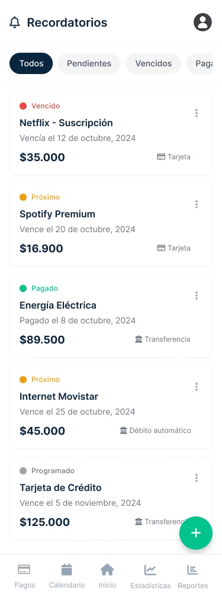

<p align="center">
  <a href="https://github.com/jjgalindez/CronoPay-App">
    
  </a>

<h3 align="center">CronoPay</h3>

<p align="center">
    Aplicación para llevar tus gastos e ingresos construida con React Native, Expo y Supabase. 
    <br />
    Desarrollada por <a href="https://github.com/jjgalindez">Jhon Galindez</a>, <a href="https://github.com/LenKid">Kedin Valencia</a>, <a href="https://github.com/Jtobar2809">Jonathan Tobar</a>, Manuel Ruge, Jair Hoyos
    <br />
    Demo app created by <a href="#">CronoTeam</a>
    <br />
    <br />
</p>

<p align="center">
  
</p>

<p align="center">
  
</p>

##  Descripción

CronoPay es una aplicación de finanzas moderna construida con Expo, NativeWind y Supabase.
Se enfoca en flujos de onboarding limpios, UI modular y estructura de proyecto mantenible.

##  Características Implementadas

### Autenticación y Seguridad
- [x] Autenticación con Supabase
- [x] Google Sign-In
- [x] Registro de usuarios
- [x] Gestión de sesiones

### Onboarding
- [x] Flujo de bienvenida
- [x] Selección de tipo de cuenta
- [x] Configuración de perfil inicial
- [x] Configuración de recordatorios iniciales

### Gestión de Perfil
- [x] Edición de perfil de usuario
- [x] Cambio de foto de perfil (cámara/galería)
- [x] Configuración de preferencias
- [x] Tema claro/oscuro
- [x] Internacionalización (i18n)

### Pagos y Finanzas
- [x] Calendario de pagos
- [x] Lista de pagos recientes
- [x] Agregar nuevos pagos
- [x] Editar pagos existentes
- [x] Eliminar pagos
- [x] Categorización de pagos
- [x] Gestión de catálogos

### Recordatorios
- [x] Crear recordatorios de pago
- [x] Editar recordatorios
- [x] Eliminar recordatorios
- [x] Notificaciones programadas con Notifee
- [x] Notificaciones push con Expo Notifications
- [x] Permisos de alarmas y recordatorios

### Estadísticas y Reportes
- [x] Pantalla de inicio con resumen
- [x] Gráfico de dona (DonutChart)
- [x] Gráfico de líneas (LineStatsGraph)
- [x] Reportes de gastos
- [x] Estadísticas por categoría

### UI/UX
- [x] Diseño responsive
- [x] Tema oscuro/claro
- [x] Componentes reutilizables
- [x] Navegación con tabs
- [x] Animaciones con Reanimated
- [x] Gestos con Gesture Handler
- [x] Selector de mes/año
- [x] Botones flotantes

##  Características Pendientes

- [ ] Exportar reportes a PDF
- [ ] Sincronización con cuentas bancarias
- [ ] Presupuestos mensuales
- [ ] Metas de ahorro
- [ ] Modo offline completo
- [ ] Backup automático
- [ ] Compartir gastos entre usuarios

##  Instalación

### Prerrequisitos

1. **Node.js** (v18 o superior)
2. **Bun** (gestor de paquetes)
3. **Android Studio** con SDK de Android
4. **Cuenta de Supabase**
5. **Cuenta de Google Cloud** (para Google Sign-In)

### Pasos de Instalación

1. **Clonar el repositorio**
   ```bash
   git clone https://github.com/jjgalindez/CronoPay-App.git
   cd CronoPay-App
   ```

2. **Instalar dependencias**
   ```bash
   bun install
   ```

3. **Configurar variables de entorno**
   
   Crear archivo `.env` en la raíz del proyecto:
   ```env
   EXPO_PUBLIC_SUPABASE_URL=tu_supabase_url
   EXPO_PUBLIC_SUPABASE_ANON_KEY=tu_supabase_anon_key
   EXPO_PUBLIC_GOOGLE_WEB_CLIENT_ID=tu_google_web_client_id
   ```
4. **Generar proyecto nativo**
   ```bash
   bun expo prebuild
   ```

5. **Configurar Android SDK**
   
   Crear el archivo `android/local.properties` y agregar:
   ```properties
   sdk.dir=C:\\Users\\<tu_usuario>\\AppData\\Local\\Android\\Sdk
   ```


6. **Ejecutar en Android**
   ```bash
   bun react-native run-android
   ```

7. **Ejecutar**
   ```bash
   bun expo start
   ```

##  Configuración

### Supabase

1. Crear un proyecto en [Supabase](https://supabase.com)
2. Ejecutar las migraciones de base de datos (ver `lib/database.types.ts`)
3. Configurar las políticas de seguridad (RLS)
4. Obtener la URL y la clave anónima del proyecto

### Google Sign-In

1. Crear un proyecto en [Google Cloud Console](https://console.cloud.google.com)
2. Habilitar Google Sign-In API
3. Crear credenciales OAuth 2.0
4. Configurar el SHA-1 de tu keystore de Android

### Notifee

Las notificaciones locales están configuradas con Notifee para Android:
- Plugin personalizado: `plugins/notifee.plugin.js`
- Hook de utilidad: `src/hooks/useNotifee.ts`
- Permisos de alarmas configurados automáticamente


##  Licencia

Este proyecto es privado y está desarrollado por el equipo de CronoPay.

##  Autores

- **Jhon Galindez** - [@jjgalindez](https://github.com/jjgalindez)
- **Kedin Valencia** - [@LenKid](https://github.com/LenKid)
- **Jhonatan Tobar**
- **Manuel Ruge**
- **Jair Hoyos**

##  Contacto

Para preguntas o sugerencias, contacta al equipo de desarrollo.

---

<p align="center">Hecho con  por el equipo de CronoPay</p>